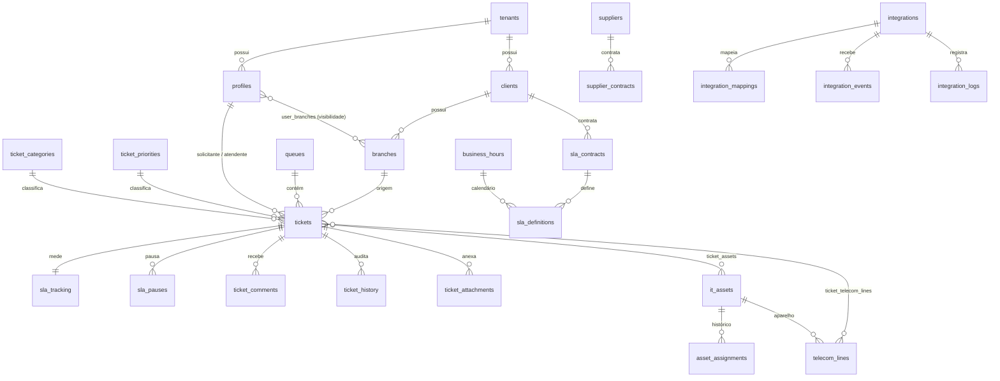

# 04 — Modelo de Dados

44 tabelas e 14 views em `public`, com 114 policies de RLS. Nomenclatura conforme
[ADR-012](03-arquitetura.md#adr-012).

## 1. Visão geral



## 2. Tabelas por domínio

### Núcleo (0002)
| Tabela | Papel |
|---|---|
| `tenants` | Assinante do SaaS. Fronteira de isolamento. Guarda preferências (limiares de SLA, fechamento automático) e o contador de numeração de tickets. |
| `profiles` | Extensão de `auth.users` com papel e tenant. `super_admin` tem `tenant_id` nulo. |
| `clients` | Grupo econômico atendido. |
| `branches` | Filial. Carrega `timezone` e `business_hours_id` — base do cálculo de SLA. |
| `user_branches` | N:N que define a visibilidade do atendente. `is_primary` indica a filial padrão. |

### Calendários (0003)
`business_hours`, `business_hours_intervals` (janelas por dia da semana),
`business_hours_holidays` (feriados regionais).

### Taxonomia e filas (0004)
`ticket_priorities` (com `weight` para o score), `ticket_categories`
(2 níveis, imposto por trigger), `queues` (a padrão é protegida contra
remoção/renome/desativação), `queue_members`, `queue_rules` (condições em JSONB).

### Tickets (0005)
`tickets`, `ticket_status_transitions` (a máquina de estados como dado),
`ticket_comments`, `ticket_attachments`, `ticket_history`.

### SLA (0006)
`sla_contracts` (cliente, opcionalmente sobrescrito por filial),
`sla_definitions` (alvos por contrato × categoria × prioridade),
`sla_tracking` (1:1 com ticket), `sla_pauses` (intervalos).

### Inventário (0007)
`it_assets`, `asset_assignments` (linha do tempo do lifecycle),
`telecom_lines`, `ticket_assets`, `ticket_telecom_lines`.

### Fornecedores (0008)
`suppliers`, `supplier_contracts`.

### Integrações (0009)
`integrations`, `integration_mappings`, `integration_events` (idempotência),
`integration_logs`, `integration_sync_state` (supressão de eco).

### Auditoria e dashboard (0010–0011)
`audit_log`, `dashboard_layouts`, `dashboard_tokens`.

### Áreas, anexos e conectividade (0013)
Camada de dados das lacunas especificadas em
[06 — Lacunas e Roadmap](06-lacunas-e-roadmap.md).

| Tabela | Papel |
|---|---|
| `branch_areas` | Subdivisões da filial (Recepção, Enfermagem, TI…). Base do detalhamento por área em inventário, telefonia, links e mapas. |
| `asset_attachments` | Notas fiscais e fotos do ativo; uma foto principal garantida por índice parcial. |
| `telecom_line_attachments` | Contratos, adendos e termos de fidelidade da linha. |
| `internet_links` | Links de internet por filial: tecnologia, banda, IP fixo, CPE, contrato, custo e estado de monitoração. |
| `internet_link_attachments` | Documentos do link. |
| `link_availability_events` | Histórico de indisponibilidade, com duração como coluna gerada e idempotência por ID externo. |
| `integration_mapping_versions` | Snapshot do conjunto de mapeamentos, para rollback. |

Colunas acrescentadas: `it_assets.branch_area_id`, `telecom_lines.company_area_id`
e vigência de contrato, `asset_assignments.previous_*` + `reason`,
`ticket_attachments.kind`/`thumbnail_path`/`scan_status`, `tenants.attachment_quota_mb`,
`queues.tiebreaker`, `sla_definitions.name`/`deleted_at`,
`branches.latitude`/`longitude`.

## 3. Padrões estruturais

### 3.1 Chave composta `(id, tenant_id)`
Quase toda tabela tem `UNIQUE (id, tenant_id)` e as FKs referenciam o **par**:

```sql
constraint fk_tickets_branch foreign key (branch_id, tenant_id)
  references public.branches (id, tenant_id)
```

Redundante em teoria — `branch_id` já identifica a filial. **Intencional na
prática:** impede, no nível do banco, que um ticket do tenant A aponte para uma
filial do tenant B. Um bug de aplicação que montasse esse vínculo é rejeitado
pelo Postgres em vez de virar vazamento silencioso entre tenants.

### 3.2 Soft delete
Entidades de negócio têm `deleted_at`; índices únicos e de consulta usam
`WHERE deleted_at IS NULL`. Preserva histórico de atendimento e rastreabilidade
contábil de patrimônio (antipattern A-09).

### 3.3 Unicidade por tenant
Patrimônio, número de série, CNPJ e número de telefone são únicos **dentro do
tenant**, nunca globalmente — dois assinantes podem legitimamente ter a mesma
tag de patrimônio.

### 3.4 Índices parciais
Os índices quentes cobrem apenas linhas em aberto:

```sql
create index idx_tickets_queue_open on public.tickets (tenant_id, queue_id, created_at)
  where deleted_at is null and status not in ('resolved','closed');
```

Um helpdesk acumula anos de tickets fechados; o trabalho diário toca só os
abertos. O índice parcial mantém a estrutura pequena mesmo com a tabela grande —
é o que sustenta o requisito de dashboard em menos de 3s (RNF-02).

## 4. Funções

| Função | Papel |
|---|---|
| `app.current_tenant_id()` | Tenant da sessão, de `app_metadata` |
| `app.current_user_branch_ids()` | Filiais visíveis (`uuid[]`, para `= ANY`) |
| `app.can_see_branch(uuid)` | Predicado de visibilidade reutilizado nas policies |
| `app.fn_add_business_minutes()` | Prazo a partir de minutos úteis |
| `app.fn_business_minutes_between()` | Minutos úteis decorridos |
| `app.fn_resolve_sla()` | Qual SLA se aplica (precedência determinística) |
| `app.sla_state()` | Semáforo: `ok / warning / critical / breached / met` |
| `app.queue_score()` | Score de priorização normalizado |
| `app.resolve_dashboard_token()` | Valida token de TV e devolve o escopo |
| `app.purge_integration_logs()` | Retenção de 90 dias |

## 5. Triggers

| Trigger | Tabela | Efeito |
|---|---|---|
| `trg_*_touch` | todas com `updated_at` | mantém `updated_at` |
| `trg_tickets_before_insert` | `tickets` | numeração, fila padrão, filial e cliente derivados |
| `trg_tickets_before_update` | `tickets` | valida transição, carimba `resolved_at`/`closed_at`, conta reaberturas |
| `trg_tickets_history` | `tickets` | grava `ticket_history` campo a campo |
| `trg_tickets_sla_init` | `tickets` | cria `sla_tracking` com os prazos |
| `trg_tickets_sla_update` | `tickets` | abre/fecha pausas, recalcula prazos, marca breach |
| `trg_comment_first_response` | `ticket_comments` | carimba TFR na 1ª resposta pública de agente |
| `trg_protect_default_queue` | `queues` | protege a fila padrão |
| `trg_assets_history` | `it_assets` | gera eventos de lifecycle |
| `trg_profiles_no_escalation` | `profiles` | bloqueia auto-promoção de papel |
| `trg_*_audit` | 18 tabelas | auditoria global |

Auditoria e histórico são **triggers**, não código de aplicação: escrita por
integração, job ou SQL direto fica registrada do mesmo jeito (antipattern A-06).

## 6. Views

Todas com `security_invoker = true` — sem isso, executariam com privilégios do
dono e ignorariam o RLS das tabelas base, transformando cada view em vazamento
entre tenants.

| View | Uso |
|---|---|
| `vw_tickets_enriched` | Ticket + SLA + rótulos + semáforo + score |
| `vw_dashboard_metrics` | Contadores do painel em uma passada |
| `vw_agents_online` | Presença (últimos 5 min) |
| `vw_sla_compliance` | Compliance por mês, fila, atendente e cliente |
| `vw_telecom_costs` | Custos por filial e operadora |
| `vw_telecom_dashboard` | Telefonia agregada por filial, área, operadora, tipo e status |
| `vw_internet_dashboard` | Links por filial, operadora e tecnologia, com quedas e contratos vencendo |
| `vw_connectivity_cost` | Telefonia + links consolidados por filial |
| `vw_map_tickets` · `vw_map_assets` · `vw_map_telecom` · `vw_map_internet` | Agregação por filial com coordenadas e semáforo calculado **na view** |
| `vw_map_area_breakdown` | Detalhamento por área, para o popup do marcador |
| `asset_custody_history` | Timeline de custódia sobre `asset_assignments`, com o nome pedido pelo escopo |

## 7. Verificação

`supabase/tests/schema_test.sql` roda contra um banco semeado, com um papel
**sem `BYPASSRLS`** — como superusuário, todo teste de isolamento passaria
trivialmente e não provaria nada. São 114 asserções cobrindo cobertura de RLS,
isolamento entre tenants, visibilidade por filial, comentário interno oculto do
solicitante, escalonamento de privilégio, máquina de estados, fila padrão,
precedência de SLA, pausa/retomada, idempotência, numeração, views, tokens de TV
e lifecycle de ativos.

```bash
npm run db:validate
```
