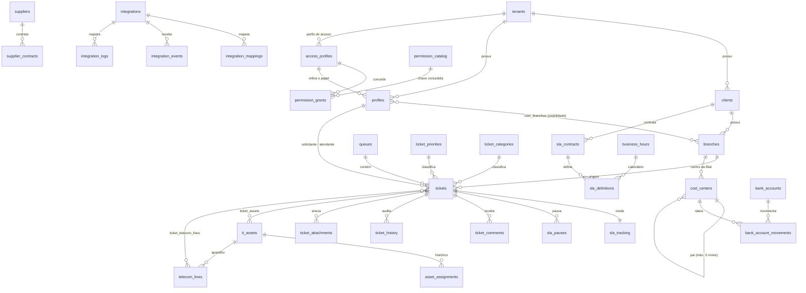

# 04 — Modelo de Dados

52 tabelas e 17 views em `public`, com 138 policies de RLS, mais 3 policies em
`storage.objects` para o bucket de anexos. Nomenclatura conforme
[ADR-012](03-arquitetura.md#adr-012).

> Os números acima são medidos no banco de validação (`npm run db:validate`), não
> contados à mão nos arquivos de migração — parte das policies é gerada em laço
> em `0012_rls_policies.sql` e não aparece como `create policy` literal.

## 1. Visão geral



`permission_catalog` é a única tabela **sem `tenant_id`**: ela descreve a
superfície da aplicação, que é a mesma para todo mundo. O que é por tenant é a
concessão.

## 2. Tabelas por domínio

### Núcleo (0002)
| Tabela | Papel |
|---|---|
| `tenants` | Assinante do SaaS. Fronteira de isolamento. Guarda preferências (limiares de SLA, fechamento automático) e o contador de numeração de tickets. |
| `profiles` | Extensão de `auth.users` com papel e tenant. `super_admin` tem `tenant_id` nulo. |
| `clients` | Grupo econômico atendido. |
| `branches` | Filial. Carrega `timezone` e `business_hours_id` — base do cálculo de SLA. |
| `user_branches` | N:N que define a visibilidade do atendente. `is_primary` indica a filial padrão. |

### Calendários (0003)
`business_hours`, `business_hours_intervals` (janelas por dia da semana),
`business_hours_holidays` (feriados regionais).

### Taxonomia e filas (0004)
`ticket_priorities` (com `weight` para o score), `ticket_categories`
(2 níveis, imposto por trigger), `queues` (a padrão é protegida contra
remoção/renome/desativação), `queue_members`, `queue_rules` (condições em JSONB).

### Tickets (0005)
`tickets`, `ticket_status_transitions` (a máquina de estados como dado),
`ticket_comments`, `ticket_attachments`, `ticket_history`.

### SLA (0006)
`sla_contracts` (cliente, opcionalmente sobrescrito por filial),
`sla_definitions` (alvos por contrato × categoria × prioridade),
`sla_tracking` (1:1 com ticket), `sla_pauses` (intervalos).

### Inventário (0007)
`it_assets`, `asset_assignments` (linha do tempo do lifecycle),
`telecom_lines`, `ticket_assets`, `ticket_telecom_lines`.

### Fornecedores (0008)
`suppliers`, `supplier_contracts`.

### Integrações (0009)
`integrations`, `integration_mappings`, `integration_events` (idempotência),
`integration_logs`, `integration_sync_state` (supressão de eco).

### Auditoria e dashboard (0010–0011)
`audit_log`, `dashboard_layouts`, `dashboard_tokens`.

### Áreas, anexos e conectividade (0013)
Camada de dados das lacunas especificadas em
[06 — Lacunas e Roadmap](06-lacunas-e-roadmap.md).

| Tabela | Papel |
|---|---|
| `branch_areas` | Subdivisões da filial (Recepção, Enfermagem, TI…). Base do detalhamento por área em inventário, telefonia, links e mapas. |
| `asset_attachments` | Notas fiscais e fotos do ativo; uma foto principal garantida por índice parcial. |
| `telecom_line_attachments` | Contratos, adendos e termos de fidelidade da linha. |
| `internet_links` | Links de internet por filial: tecnologia, banda, IP fixo, CPE, contrato, custo e estado de monitoração. |
| `internet_link_attachments` | Documentos do link. |
| `link_availability_events` | Histórico de indisponibilidade, com duração como coluna gerada e idempotência por ID externo. |
| `integration_mapping_versions` | Snapshot do conjunto de mapeamentos, para rollback. |

Colunas acrescentadas: `it_assets.branch_area_id`, `telecom_lines.company_area_id`
e vigência de contrato, `asset_assignments.previous_*` + `reason`,
`ticket_attachments.kind`/`thumbnail_path`/`scan_status`, `tenants.attachment_quota_mb`,
`queues.tiebreaker`, `sla_definitions.name`/`deleted_at`,
`branches.latitude`/`longitude`.

### Geolocalização (0014–0016)
Endereço estruturado, pipeline de geocodificação e rastro de auditoria do
processo — ver [05 — Geolocalização](05-geolocalizacao.md).

| Tabela | Papel |
|---|---|
| `geocode_logs` | Cada tentativa de geocodificação: provedor, precisão obtida, motivo da recusa. É o que permite responder "por que esta filial não tem coordenada". |
| `geocode_candidates` | Candidatos devolvidos pelo provedor quando o endereço é ambíguo, para confirmação humana em vez de escolha silenciosa. |

Colunas acrescentadas em `branches`: logradouro, número, complemento, bairro,
CEP, `geocode_precision`, `geocoded_at`, `address_updated_at`.

### Perfis de acesso e permissões (0017)
Camada de autorização granular especificada em
[07 — Financeiro e Permissões](07-financeiro-e-permissoes.md).

| Tabela | Papel |
|---|---|
| `permission_catalog` | Catálogo **global** (sem `tenant_id`) das chaves `modulo` / `modulo.tela` / `modulo.tela.acao`. `min_base_role` é o teto de papel que a chave exige. Um CHECK garante que `key` seja exatamente a concatenação das três colunas — chave e componentes não podem divergir. |
| `access_profiles` | Perfil de acesso por tenant. `base_role` declara o papel que o perfil implica, e `is_system` marca os 9 perfis semeados por trigger, que são atribuíveis mas não editáveis. |
| `permission_grants` | Concessão. **Não tem coluna `allowed`**: a presença da linha é a permissão. Booleano por linha conviveria mal com "negação herda, liberação é explícita" — haveria dois jeitos de negar e nenhum canônico. |

Coluna acrescentada: `profiles.access_profile_id` (nulo = comportamento anterior,
só o papel). O papel **coexiste** com o perfil e continua governando as policies
de RLS; o perfil só restringe, nunca eleva — ver `app.effective_base_role()`.

### Base do financeiro (0018)
| Tabela | Papel |
|---|---|
| `cost_centers` | Centros hierárquicos até 3 níveis, com trigger que recusa o 4º e também o ciclo. `branch_id` nulo = centro global do tenant; preenchido = custo cobrável por unidade. |
| `bank_accounts` | Conta do tenant. Guarda `opening_balance` e `credit_limit`; **não guarda saldo corrente** — ver a view. |
| `bank_account_movements` | Entrada ou saída. `amount` é sempre positivo e o sinal vive em `direction`, para não existir a combinação absurda "saída de valor negativo". Transferência interna são duas linhas com o mesmo `transfer_group`, e uma constraint trigger `deferrable` recusa meia transferência. |

Correção estrutural na mesma migração: `supplier_contracts` ganhou
`unique (id, tenant_id)`. Sem ela nenhum título a pagar poderia referenciar o
contrato por FK composta, e o padrão do
[ADR-001](03-arquitetura.md#adr-001) ficaria impossível de seguir no financeiro.

### Anexos no Storage (0019)
Nenhuma tabela nova: as quatro de anexo já existiam desde a 0005 e a 0013, todas
com `storage_path text not null` e **nenhum caminho de upload** — anexar arquivo a
um ticket era impossível. A 0019 acrescenta o bucket e a autorização.

| Objeto | Papel |
|---|---|
| `storage.buckets` → `anexos` | Bucket **privado**, 25 MB por arquivo, 13 tipos aceitos. Público tornaria `storage_path` uma URL adivinhável, e anexo de ticket de Home Care pode conter dado de saúde. |
| 3 policies em `storage.objects` | `select`, `insert` e `delete` separados, porque são decisões distintas. **Não existe policy de UPDATE**: trocar o conteúdo mantendo caminho e metadados é substituição silenciosa de prova documental — corrigir é remover e anexar de novo. |

A convenção de caminho é `{tenant_id}/{entidade}/{entity_id}/{arquivo}`, e não é
nova: `supabase/seed.sql` já gravava assim. O primeiro segmento ser o tenant é o
que dá ao Storage a mesma fronteira de isolamento das 138 policies de `public`
(ADR-002), em vez de uma paralela.

O bucket **não** usa `service_role`: o upload sai pelo cliente da sessão, então as
policies decidem. O ADR-011 sanciona exatamente dois usos daquela chave, e um
terceiro por conveniência de upload contornaria a autorização recém-construída.

## 3. Padrões estruturais

### 3.1 Chave composta `(id, tenant_id)`
Quase toda tabela tem `UNIQUE (id, tenant_id)` e as FKs referenciam o **par**:

```sql
constraint fk_tickets_branch foreign key (branch_id, tenant_id)
  references public.branches (id, tenant_id)
```

Redundante em teoria — `branch_id` já identifica a filial. **Intencional na
prática:** impede, no nível do banco, que um ticket do tenant A aponte para uma
filial do tenant B. Um bug de aplicação que montasse esse vínculo é rejeitado
pelo Postgres em vez de virar vazamento silencioso entre tenants.

### 3.2 Soft delete
Entidades de negócio têm `deleted_at`; índices únicos e de consulta usam
`WHERE deleted_at IS NULL`. Preserva histórico de atendimento e rastreabilidade
contábil de patrimônio (antipattern A-09).

### 3.3 Unicidade por tenant
Patrimônio, número de série, CNPJ e número de telefone são únicos **dentro do
tenant**, nunca globalmente — dois assinantes podem legitimamente ter a mesma
tag de patrimônio.

### 3.4 Índices parciais
Os índices quentes cobrem apenas linhas em aberto:

```sql
create index idx_tickets_queue_open on public.tickets (tenant_id, queue_id, created_at)
  where deleted_at is null and status not in ('resolved','closed');
```

Um helpdesk acumula anos de tickets fechados; o trabalho diário toca só os
abertos. O índice parcial mantém a estrutura pequena mesmo com a tabela grande —
é o que sustenta o requisito de dashboard em menos de 3s (RNF-02).

## 4. Funções

| Função | Papel |
|---|---|
| `app.current_tenant_id()` | Tenant da sessão, de `app_metadata` |
| `app.current_user_branch_ids()` | Filiais visíveis (`uuid[]`, para `= ANY`) |
| `app.can_see_branch(uuid)` | Predicado de visibilidade reutilizado nas policies |
| `app.fn_add_business_minutes()` | Prazo a partir de minutos úteis |
| `app.fn_business_minutes_between()` | Minutos úteis decorridos |
| `app.fn_resolve_sla()` | Qual SLA se aplica (precedência determinística) |
| `app.sla_state()` | Semáforo: `ok / warning / critical / breached / met` |
| `app.queue_score()` | Score de priorização normalizado |
| `app.resolve_dashboard_token()` | Valida token de TV e devolve o escopo |
| `app.purge_integration_logs()` | Retenção de 90 dias |
| `app.role_rank(text)` | Ordena os 6 papéis, para comparar teto de privilégio |
| `app.current_access_profile_id()` | Perfil de acesso da sessão |
| `app.has_permission(text)` | Chave concedida **e** todos os seus ancestrais. É aqui que a herança de negação vive |
| `app.effective_base_role()` | O **menor** entre `profiles.role` e o `base_role` do perfil — o perfil restringe o RLS e nunca o eleva |
| `app.seed_system_access_profiles(uuid)` | Cria os 9 perfis do sistema e suas concessões, expressas como regra sobre o catálogo |
| `app.storage_tenant(text)` | Tenant do caminho do anexo; **NULL** em caminho malformado, porque exceção dentro de policy vira erro 500 opaco em vez de negação limpa |
| `app.storage_entity(text)` | Entidade do caminho (segundo segmento) |
| `app.storage_permission_key(text, text)` | Mapa explícito entidade × verbo → chave. O `else null` é a decisão de segurança: prefixo novo no bucket não nasce liberado |
| `app.can_touch_attachment(text, text)` | Predicado das 3 policies do bucket. Nega por omissão em toda saída |

As concessões dos perfis de sistema são **regra sobre o catálogo**, não lista de
chaves. Listar ~108 chaves nove vezes garantiria que a próxima permissão entrasse
em alguns perfis e fosse esquecida em outros.

## 5. Triggers

| Trigger | Tabela | Efeito |
|---|---|---|
| `trg_*_touch` | todas com `updated_at` | mantém `updated_at` |
| `trg_tickets_before_insert` | `tickets` | numeração, fila padrão, filial e cliente derivados |
| `trg_tickets_before_update` | `tickets` | valida transição, carimba `resolved_at`/`closed_at`, conta reaberturas |
| `trg_tickets_history` | `tickets` | grava `ticket_history` campo a campo |
| `trg_tickets_sla_init` | `tickets` | cria `sla_tracking` com os prazos |
| `trg_tickets_sla_update` | `tickets` | abre/fecha pausas, recalcula prazos, marca breach |
| `trg_comment_first_response` | `ticket_comments` | carimba TFR na 1ª resposta pública de agente |
| `trg_protect_default_queue` | `queues` | protege a fila padrão |
| `trg_assets_history` | `it_assets` | gera eventos de lifecycle |
| `trg_profiles_no_escalation` | `profiles` | bloqueia auto-promoção de papel |
| `trg_*_audit` | 18 tabelas | auditoria global |
| `trg_branches_geocode_staleness` | `branches` | invalida a coordenada quando o endereço muda |
| `trg_tenants_seed_access_profiles` | `tenants` | cria os 9 perfis do sistema no nascimento do tenant |
| `trg_profiles_default_access_profile` | `profiles` | atribui o perfil correspondente ao papel |
| `trg_profiles_no_self_profile_change` | `profiles` | ninguém troca o próprio perfil de acesso |
| `trg_access_profiles_guard_system` | `access_profiles` | perfil do sistema não é editável nem removível |
| `trg_permission_grants_within_base_role` | `permission_grants` | recusa concessão acima do `base_role` do perfil |
| `trg_cost_center_depth` | `cost_centers` | recusa o 4º nível e o ciclo |
| `trg_movements_transfer_pairs` | `bank_account_movements` | constraint trigger `deferrable`: recusa transferência com uma só metade |

Os dois primeiros gatilhos de perfil existem por um motivo específico: migração
roda **antes** do seed, então um laço sobre `tenants` dentro da 0017 não
encontraria tenant nenhum. Sem eles o ambiente subiria com zero perfis, e um
usuário sem perfil tem `has_permission` falso em tudo — todas as telas negadas,
sem causa visível.

Auditoria e histórico são **triggers**, não código de aplicação: escrita por
integração, job ou SQL direto fica registrada do mesmo jeito (antipattern A-06).

## 6. Views

Todas com `security_invoker = true` — sem isso, executariam com privilégios do
dono e ignorariam o RLS das tabelas base, transformando cada view em vazamento
entre tenants.

| View | Uso |
|---|---|
| `vw_tickets_enriched` | Ticket + SLA + rótulos + semáforo + score |
| `vw_dashboard_metrics` | Contadores do painel em uma passada |
| `vw_agents_online` | Presença (últimos 5 min) |
| `vw_sla_compliance` | Compliance por mês, fila, atendente e cliente |
| `vw_telecom_costs` | Custos por filial e operadora |
| `vw_telecom_dashboard` | Telefonia agregada por filial, área, operadora, tipo e status |
| `vw_internet_dashboard` | Links por filial, operadora e tecnologia, com quedas e contratos vencendo |
| `vw_connectivity_cost` | Telefonia + links consolidados por filial |
| `vw_map_tickets` · `vw_map_assets` · `vw_map_telecom` · `vw_map_internet` | Agregação por filial com coordenadas e semáforo calculado **na view** |
| `vw_map_area_breakdown` | Detalhamento por área, para o popup do marcador |
| `asset_custody_history` | Timeline de custódia sobre `asset_assignments`, com o nome pedido pelo escopo |
| `vw_branch_addresses` | Endereço estruturado consolidado da filial |
| `vw_branch_last_geocode_log` | Última tentativa de geocodificação por filial |
| `vw_bank_account_balances` | Saldo **derivado**: inicial + entradas − saídas, com contagem de não conciliadas. Saldo materializado divergiria do extrato no primeiro arredondamento |

## 7. Verificação

`supabase/tests/schema_test.sql` roda contra um banco semeado, com um papel
**sem `BYPASSRLS`** — como superusuário, todo teste de isolamento passaria
trivialmente e não provaria nada. São 203 asserções cobrindo cobertura de RLS,
isolamento entre tenants, visibilidade por filial, comentário interno oculto do
solicitante, escalonamento de privilégio, máquina de estados, fila padrão,
precedência de SLA, pausa/retomada, idempotência, numeração, views, tokens de TV,
lifecycle de ativos, a tabela-verdade de `app.has_permission()` e a matriz de
permissões aplicada aos usuários do seed.

```bash
npm run db:validate
```
